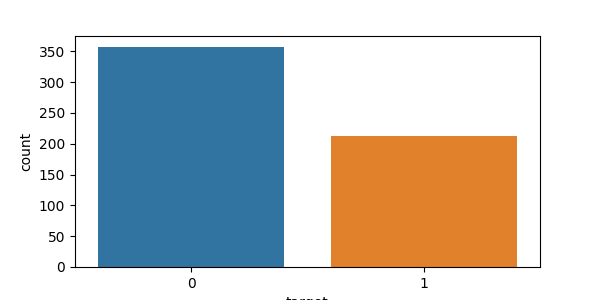
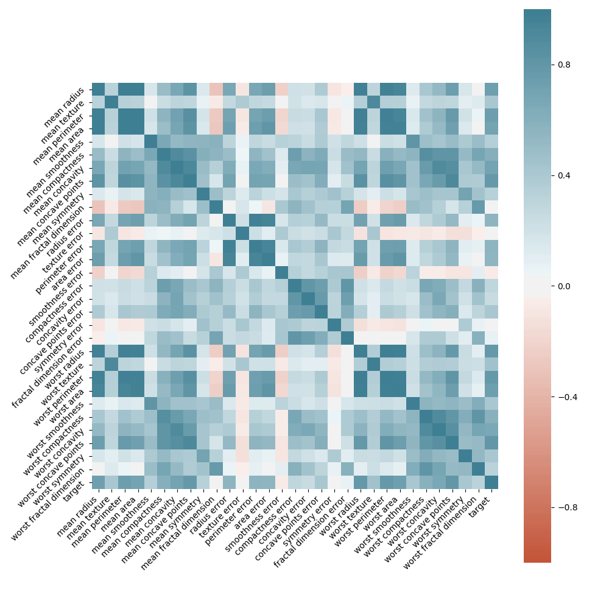

# cebd1160 final project: Breast cancer dataset

| Name | Date |
|:-------|:---------------|
|Paola Rimac | Jun 15, 2019 |

-----

### Resources

- Python script for your analysis: `classification_analysis.py`
- Results figure/saved file: `figures/`
- Dockerfile for your experiment: `Dockerfile`
- runtime-instructions in a file named `RUNME.md`

-----

## Research Question

From the 30 atributes of breast cancer dataset, which attributes have more correlation and which not, and also which prediction model 
between PCA, KNN and Logistic Regression has more accuracy to predict the diagnosis.

### Abstract

Derived from UCI Machine Learning Repository, a brest cancer dataset is freely available in python's sklearn library and it represents the features computed 
from digitized image of a fine needle aspirate (FNA) of a breast mass.
Using these dataset, the understanding of this characteristics and its relationships could impact in the prediction of malignant or bening cancer. 
To achieve this I have used some machine learning classification methods to fit a function that can predict the discrete class of new input. 

### Introduction

###### Identify the problem

Breast cancer is the most common cancer among canadian women and it is the second leading cause of death from cancer according to Canadian Cancer Society. 
Some statistics from 2017 are: 
- 26,300 women were diagnosed with breast cancer and that was 25% of all new cancer in woman in 2017. 
- 5,000 women died from breast cancer which represents 13% of all cancer deaths in women. 
- An average of 72 canadian women were diagnosed from breast cancer every day.
- An average 14 canadian woman died from breast cancer every day.

The rate of incidence of breast cancer in Canada rose in the early of 90's but decreased in the early of 2000's and one of the reason was the use of mamography. 
In addtion the death rate has been declining since the mid of 80's and this is the reflect of the improvement of screening and imaging.(*) 

###### Description of the dataset
The dataset is from the "Breast Cancer Wisconsin (Diagnostic) Database" freely available in python's sklearn library (https://archive.ics.uci.edu/ml/datasets/Breast+Cancer+Wisconsin+%28Diagnostic%29)

Number of Samples: 569
Number of Features: 30 numeric attributes
Number of Classes: 2

Ten real-valued features are computed for each cell nucleus. 
The mean, standard error and 'worst' or largest (mean of the three largest values) of these features were computed for each image, resulting in 30 features. 
For instance, the radius measurements are for the 'mean radius', 'standard error of the radius', and 'worst radius'. 

Describe feature statistics

           mean radius  mean texture   mean perimeter  mean area     mean smoothness  mean compactness
    count   569.000000    569.000000      569.000000   569.000000       569.000000        569.000000
    mean     14.127292     19.289649       91.969033   654.889104         0.096360          0.104341
    std       3.524049      4.301036       24.298981   351.914129         0.014064          0.052813
    min       6.981000      9.710000       43.790000   143.500000         0.052630          0.019380
    25%      11.700000     16.170000       75.170000   420.300000         0.086370          0.064920
    50%      13.370000     18.840000       86.240000   551.100000         0.095870          0.092630
    75%      15.780000     21.800000      104.100000   782.700000         0.105300          0.130400
    max      28.110000     39.280000      188.500000  2501.000000         0.163400          0.345400

###### Visualization of the data

First let's take a look of the proportion of classes 0 for Bening and 1 for Malignant in the following chart and graph.
   
    Number of cells class 0 - Benign:       357
    Number of cells class 1 - Malignant :   212
    % of cells class 0 - Benign:            62.74 %
    % of cells class 1 - Malignant:         37.26 %

                       
We can see that from the 569 observations, 357 or 62.7% are labeled as Benign and 212 or 37.2% are labeled as Malignant.
   
Now as the dataset has 30 features, a good way to check correlations between all the columns is by visualizing the correlation matrix as a heatmap
 

### Methods

Brief (no more than 1-2 paragraph) description about how you decided to approach solving it. Include:

- pseudocode for this method (either created by you or cited from somewhere else)
- why you chose this method

### Results

Brief (2 paragraph) description about your results. Include:

- At least 1 figure
- At least 1 "value" that summarizes either your data or the "performance" of your method
- A short explanation of both of the above

### Discussion
Brief (no more than 1-2 paragraph) description about what you did. Include:

- interpretation of whether your method "solved" the problem
- suggested next step that could make it better.

### References
All of the links
(*) https://www.cancer.ca/en/cancer-information/cancer-type/breast/statistics/?region=on

## Data

The data set is from the "Breast Cancer Wisconsin (Diagnostic) Database" freely available in python's sklearn library, for details see:  
https://archive.ics.uci.edu/ml/datasets/Breast+Cancer+Wisconsin+%28Diagnostic%29

* Number of Samples: 569  
* Number of Features: 30 numeric, predictive attributes  
* Number of Classes: 2 

Features are computed from a digitized image of a fine needle aspirate (FNA) of a breast mass. They describe characteristics of the cell nuclei present in the image. Ten real-valued features are computed for each cell nucleus. The mean, standard error and 'worst' or largest (mean of the three largest values) of these features were computed for each image, resulting in 30 features. For instance, the radius measurements are for the 'mean radius',  'standard error of the radius', and 'worst radius'. All feature values are recoded with four significant digits.

The two target classes correspond to negative outcomes (Benign) and positive outcomes (Malignant).

**This original data set will be randomly split into two sets for train and test purposes.**
